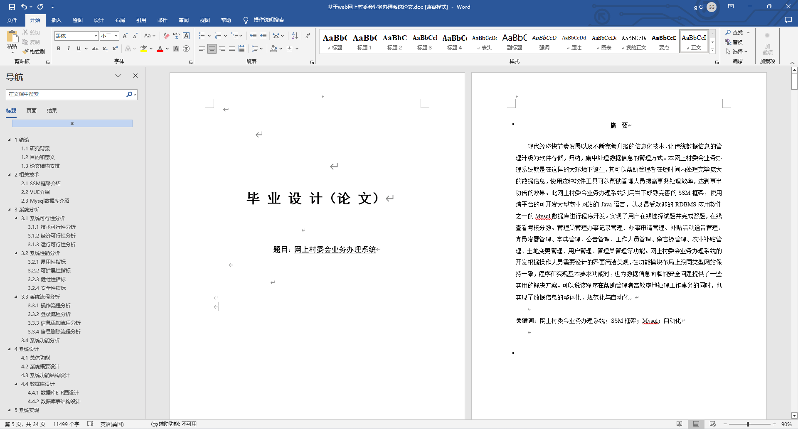
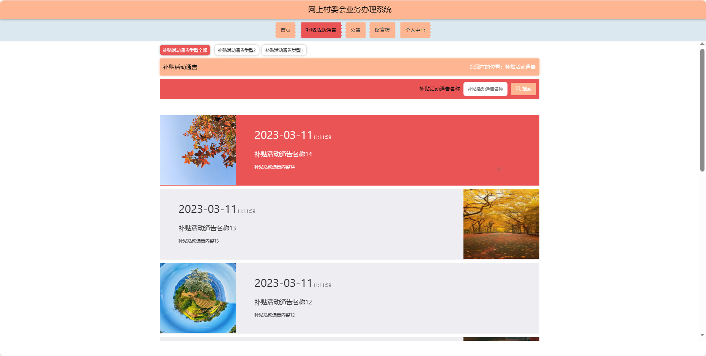
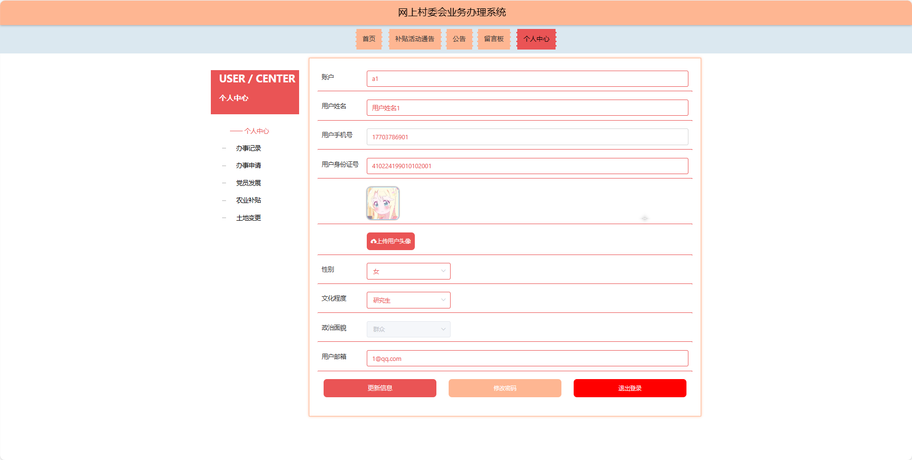
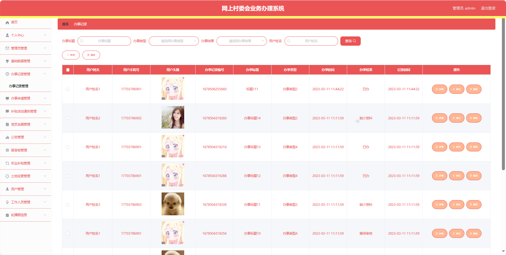
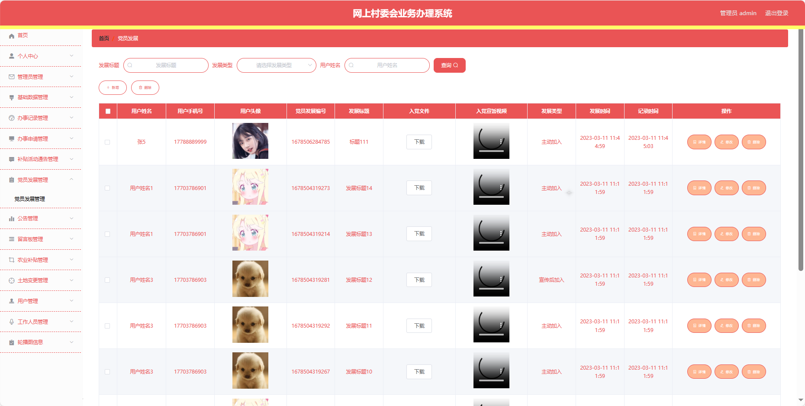
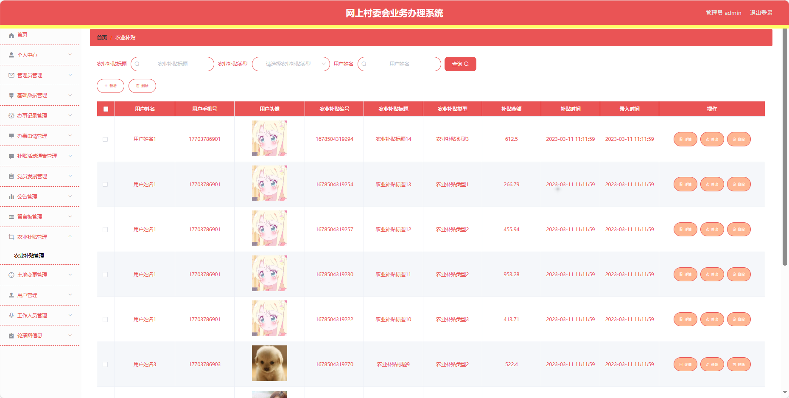
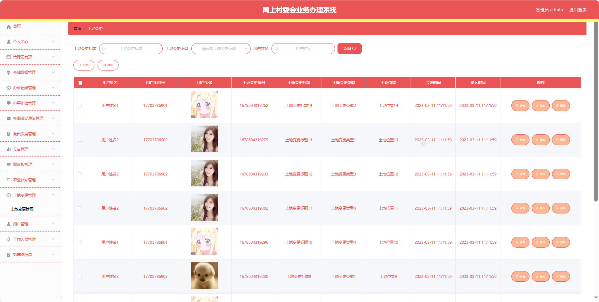

## 基于SpringBoot的网上村委会业务办理系统(程序+报告)

###  获取sql数据库文件: 从戎源码网 (https://armycodes.com/) QQ: 386869957 QQ群: 377586148
###  所有系统地址: (https://github.com/YuLin-Coder/AllProjectCatalog) 
###  所有项目以及源代码本人均调试运行无问题 可支持远程安装部署调试、定制修改、代码讲解

## 项目介绍
基于SpringBoot的网上村委会业务办理系统，系统包含三种角色：管理员、用户,工作人员主要功能如下。

### 【管理员】:
首页：查看网上村委会业务办理系统整体概况。
个人中心：修改密码、管理个人信息。
管理员管理：审核和管理注册管理员用户的信息。
基础数据管理：管理系统的基础数据，包括办事类型、办事结果、补贴活动通告类型、发展类型、公告类型、农业补贴类型、土地变更类型、文化程度等。
办事记录管理：查看和管理用户的办事记录，包括审批状态和进展。
办事申请管理：处理用户的办事申请请求，包括查看、确认等。
补贴活动通告管理：发布、编辑和删除系统的补贴活动通告。
党员发展管理：监管和管理党员发展的信息，包括申请和审批。
公告管理：发布、编辑和删除系统的通知和公告。
留言板管理：查看和管理用户在留言板上的留言。
农业补贴管理：管理农业补贴的信息，包括类型和审批情况。
土地变更管理：管理土地变更的信息，包括类型和审批情况。
用户管理：审核和管理注册用户的信息。
工作人员管理：审核和管理注册工作人员用户的信息。
轮播图信息：管理系统首页的轮播图。

### 【工作人员功能】
首页：查看网上村委会业务办理系统。
个人中心：修改密码、管理个人信息。
办事记录管理：查看和管理用户的办事记录。
办事申请管理：处理用户的办事申请请求。
补贴活动通告管理：发布、编辑和删除系统的补贴活动通告。
党员发展管理：监管和管理党员发展的信息。
公告管理：发布、编辑和删除系统的通知和公告。
留言板管理：查看和管理用户在留言板上的留言。
农业补贴管理：管理农业补贴的信息。
土地变更管理：管理土地变更的信息。
用户管理：管理用户的信息。

### 【用户】:
首页：浏览网上村委会业务办理系统的主要信息和最新通知。
补贴活动通告：查看与农村补贴相关的活动通告。
公告：阅读系统发布的相关通知和公告。
留言板：留下对村委会业务的留言和反馈。
个人中心：管理个人信息，查看办事记录和历史留言。

## 项目技术
- 编程语言：Java
- 数据库：MySQL
- 项目管理工具：Maven
- 前端技术：HTML、CSS、JavaScript、Jquery、Vue
- 后端技术：Spring、SpringMVC、MyBatis

## 运行环境
- JDK版本：JDK1.8及以上
- 开发工具：IDEA、Ecplise、Myecplise都可以
- 数据库: MySQL5.7及以上
- Maven：maven3.0及以上
- Node：14.14.0及以上

## 运行截图

